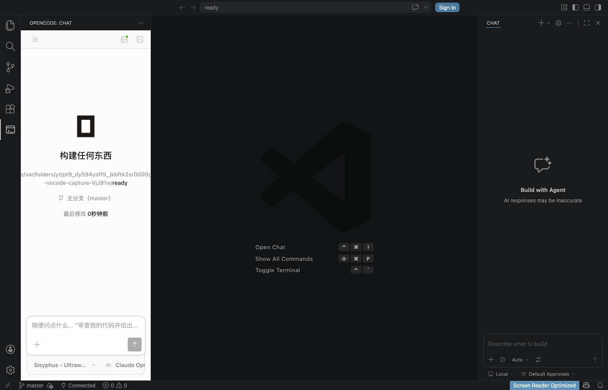

# OpenCode Web for VSCode

Full-featured VSCode extension that embeds the [OpenCode](https://opencode.ai) AI coding agent web UI directly in your sidebar.



## Features

- **Embedded Chat** — Full OpenCode web UI in the VSCode sidebar via local SPA proxy
- **Stable Session Persistence** — Auto-restores last opened session across F5/restarts
- **Full Project List** — Loads all opencode projects from backend, not just current workspace
- **Code Integration** — Send selected code to chat with `Ctrl+Shift+L` / `Cmd+Shift+L`
- **Session Management** — Create, switch, fork, revert, and share sessions
- **Inline Diff Preview** — View AI changes inline
- **File / Text / Symbol Search** — Native VSCode search palette integration
- **CodeLens Hints** — Inline AI hints on functions
- **PTY Terminal** — Embedded shell sessions
- **Provider & MCP Status** — Tree view (hidden by default)
- **Permission & Question Dialogs** — Native VSCode prompts for AI requests
- **Auto-start `opencode serve`** — Spawns and manages the backend lifecycle

## Architecture

```
VSCode Webview Sidebar
   └── iframe (http://127.0.0.1:STABLE_PORT)
        └── SPA proxy (Node http server)
             ├── /assets/* → local SPA build (./spa/)
             └── /project /session /global ... → opencode CLI server
                                                  (http://127.0.0.1:57777)
```

The extension spawns `opencode serve` and runs a local Node HTTP proxy that:

- Serves the prebuilt SPA from `./spa/` directory
- Proxies API calls to the backend opencode server
- Uses a **stable port** (hash of backend URL) so SPA's localStorage persists across restarts
- Injects a bootstrap script that seeds project data and the full project list

## Requirements

- Install the `opencode` CLI and make sure it is available at `~/.opencode/bin/opencode-cli` or on your `PATH`
- macOS users: the binary must be code-signed (`codesign --force --sign - ~/.opencode/bin/opencode`)
- VSCode 1.74+

## Installation

### From VSIX

```bash
make vsix
make install
```

### From source

```bash
git clone https://github.com/cpkt9762/opencode-web-for-vscode.git
cd opencode-web-for-vscode
bun install
make spa
make ext
make install
```

## Extension Settings

| Setting               | Default | Description                                      |
| --------------------- | ------- | ------------------------------------------------ |
| `opencode.port`       | `4096`  | Server port used by the embedded web client      |
| `opencode.binaryPath` | `""`    | Custom path to the `opencode` binary             |
| `opencode.autoStart`  | `true`  | Automatically start `opencode serve` when needed |
| `opencode.webUrl`     | `""`    | Custom SPA URL (skips local SPA server)          |

## Keyboard Shortcuts

| Command                      | Windows / Linux | macOS         | Context                                         |
| ---------------------------- | --------------- | ------------- | ----------------------------------------------- |
| OpenCode: Open Chat          | `Ctrl+Shift+O`  | `Cmd+Shift+O` | Open the chat view                              |
| OpenCode: New Session        | `Ctrl+Shift+N`  | `Cmd+Shift+N` | Create a session while the chat view is focused |
| OpenCode: Send Selected Code | `Ctrl+Shift+L`  | `Cmd+Shift+L` | Send the current selection from the editor      |
| OpenCode: Search Files       | `Ctrl+Shift+F`  | `Cmd+Shift+F` | Search files from the OpenCode sidebar          |

## Development

```bash
make help          # show all targets
make spa           # rebuild SPA assets
make ext           # rebuild extension
make watch         # esbuild watch mode
make test          # vitest unit tests (184 tests)
make test-e2e      # Playwright browser tests (32 tests)
make typecheck     # TypeScript check
make logs          # tail debug.log
make logs-clear    # clear debug.log
make vsix          # package .vsix
make install       # install into VSCode
make reinstall     # uninstall + install
make clean         # clean build outputs
```

## Debugging

The extension writes diagnostic logs to `./debug.log` for inspection:

```bash
make logs              # follow logs
make logs-clear        # clear before testing
```

Key log markers:

- `[link]` — extension SDK link lifecycle
- `[SPA]` — messages forwarded from the SPA running inside the iframe
- `[bootstrap]` — BOOTSTRAP script execution (project seeding, project list fetch)
- `[session-persist]` — workspace state save events
- `[DIAG:*]` — webview iframe state diagnostics

## License

See [LICENSE](LICENSE).
